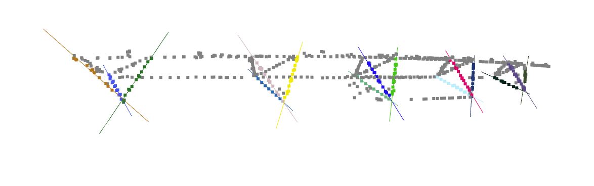
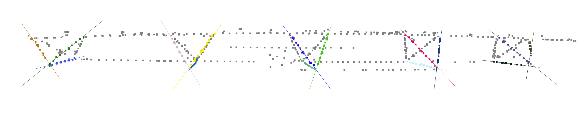

# Digital-Agriculture-Lab
## Independent Study

The following Repository contains the code, report and package files of the Independent Study done in the DIgital Agriculture Lab. 

### Code Files:

1) [Rivulet_main.ino](Rivulet_2.0/Rivulet_main.ino) - It contains the code that is to be run in Arduino Feather M4 CAN Express microcontroller. It contains the Finite-State Machine framework and Telemetry pipeline for Manual Remote Control using Flysky FS-i6s Controller.

2) [motion_planning.ipynb](Rivulet_2.0/motion_planning.ipynb) - This file contains the simulation for the motion planning and path planning of the Rivulet 2.0 robot in the centre pivot irrigation system for a circular plot field.
   
3) [code.py](Rivulet_2.0/code.py) - It contains the circuit python code to send the CAN signals to the Myactuator servo motor. It is just a test code.

4) [line_detection.ipynb](Rivulet_2.0/line_detection.ipynb) - The code file contains the filtering, clustering, detection and visualization of horizontal and diagonal trusses of the Center Pivot. It filters the area of interest and uses DBScan to cluster the points and runs RanSac on the inliers and get's the line equations and runs RANSAC again to detect the other diagonal on the outlier

### Report: 
   The [report](Independent_Study_Report.pdf) contains the complete details including steps, procedures and reference files for the project and its implementation along with the final results.

1. Media: 
   - The following Video [Field_test.mp4](Media/Field_Test.mp4) is the demonstration of the manual operation of the Rivulet robot via joystick on the Centre Pivot Irrigation system.
   - The Following Images are the results of mapping the environment and detecting the trusses of the centre pivot as explained before. 
      - The first image shows the Downsampled point cloud visualization of the center pivot irrigation system. 
         
      - The second image displays the final result after detection of trusses of the center pivot in the side view perspective of the center pivot. 
         
      - The third image displays the final result after detection of trusses of the center pivot in the front view perspective of the center pivot. 
         
