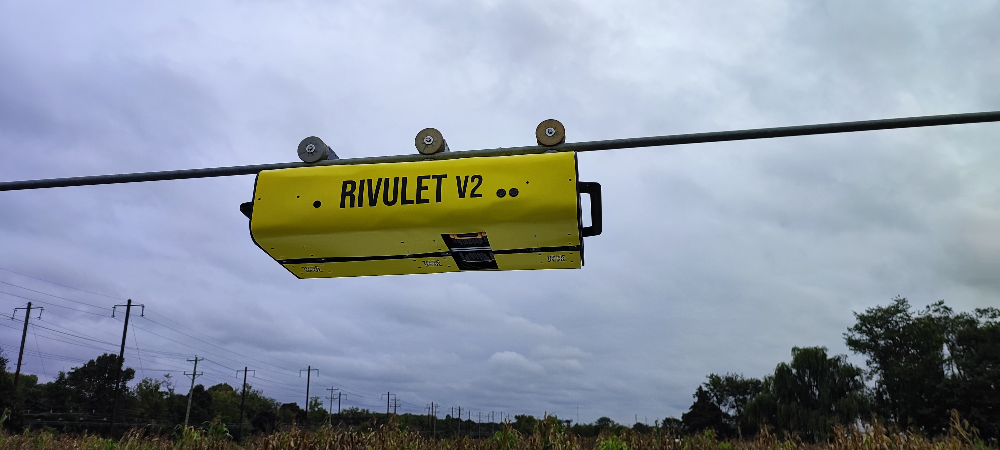

<!-- #################################################################################################################################################################################### -->

<!-- #################################################################################################################################################################################### -->
# Ag-Cypher Lab (UD) 
## Rivulet_2.0 - Independent Study

The following **[Github Repository](https://github.com/Anna02malai/Rivulet_2_0)** contains the description, code, report and package files of my Independent Study done in the Ag-Cypher Lab. 

### Problem Statement:

   To enable Autonomous navigation for the Gantry system Robots like Rivulet on the center pivot irrigation systems filled with obstacles (Truss Pockets). This enables the robot to autonomously navigate the pivot while indulging in other activities like data-collection/spraying and so on.

### Description:

   This is a research problem at its preliminary stage which involves a novel approach of navigating gantry system Robots (like Rivulet) in Centre pivot irrigation system using SLAM. Rivulet is a in-house robot developed by a team of 4 members for senior design at UD in Ag-Cypher Lab. THe idea is to further attach a custom built (3m radius sensor footprint) on the robot to collect data in a circular Centre pivot field while it is irrigating. This is a modular design which is very feasible for adding custom sprayers and other kinds of machinery and sensors for various agricultural purposes.

   So the basic step was to make it fully functional and autonomous in the centre pivot.

### Brief of my Work:

   - Designed a control system and implemented a finite-state machine integrating motors, sensors, and actuators to teleoperate a mobile gantry system on a center-pivot irrigation rig using ROS framework.
   - Integrated MID-360 LiDAR with Fast-LIO SLAM for 3D environmental mapping, obstacle detection (truss pockets), and localization to support autonomous navigation.
   - Simulated motion planning for crop coverage using a 2-DOF arm model to generate preliminary results which were accepted by **USDA** for a **$150K** research grant.

### Code Files:

1) [Rivulet_main.ino](Rivulet_2.0/Rivulet_main.ino) - It contains the code that is to be run in Arduino Feather M4 CAN Express microcontroller. It contains the Finite-State Machine framework and Telemetry pipeline for Manual Remote Control using Flysky FS-i6s Controller.

2) [motion_planning.ipynb](Rivulet_2.0/motion_planning.ipynb) - This file contains the simulation for the motion planning and path planning of the Rivulet 2.0 robot in the centre pivot irrigation system for a circular plot field.
   
3) [code.py](Rivulet_2.0/code.py) - It contains the circuit python code to send the CAN signals to the Myactuator servo motor. It is just a test code.

4) [line_detection.ipynb](Rivulet_2.0/line_detection.ipynb) - The code file contains the filtering, clustering, detection and visualization of horizontal and diagonal trusses of the Center Pivot. It filters the area of interest and uses DBScan to cluster the points and runs RanSac on the inliers and get's the line equations and runs RANSAC again to detect the other diagonal on the outlier

### Report: 
   The [report](Independent_Study_Report.pdf) contains the complete details including steps, procedures and reference files for the project and its implementation along with the final results.

### Media: 
   - The following Video [Field_test.mp4](Media/Field_Test.mp4) is the demonstration of the Teleoperation of the Rivulet robot via joystick on the Centre Pivot Irrigation system.
            
      <!--   -->
      

      <video width="640" height="360" controls>
         <source src="Media/Field_Test.mp4" type="video/mp4">
         Your browser does not support the video tag.
      </video>
      

      <!--  --> 

   - The below images show the Rivulet Robot's environmental Field setup on the Center Pivot Irrigation System.
      

         
      

      

         
      

      

         
      

   - The Following Images are the results of mapping the environment and detecting the trusses of the centre pivot as explained before. 
      - The first image shows the Downsampled point cloud visualization of the center pivot irrigation system. 
      

         
      

      - The second image displays the final result after detection of trusses of the center pivot in the side view perspective of the center pivot. 
      

         
      

      
      - The third image displays the final result after detection of trusses of the center pivot in the front view perspective of the center pivot. 
      

         
      

